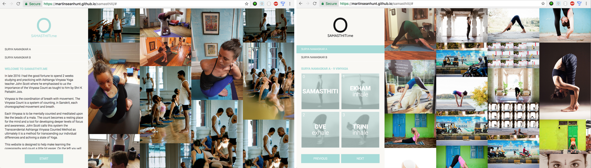

<h1>Samasthiti.me</h1>

<a href="https://martinseanhunt.github.io/samasthiti/">Samasthiti.me</a> is a responsive application that helps users to learn the Ashtanga Yoga Vinyasa Count, a sequence of coreographed breath and movement combinations. It displays user generated images, pulled from the Flickr API, relating to the posture or sequence that the user is studying.

<h2>About the app</h2>

In late 2016 I had the good fortune to spend 2 weeks studying and practicing with Ashtanga Vinyasa Yoga teacher John Scott where he emphasised to us the importance of the Vinyasa Count as tought to him by Shri K Pattabhi Jois.

Vinyasa is the coordination of breath with movement. The Vinyasa Count is a system of counting, in Sanskrit, each choreographed movement and breath.

Each Vinyasa is to be mentally counted and meditated upon like the beads of a mala. The count becomes a resting place for the mind and a tool for developing deeper levels of focus and awareness. John Scott calls this system the Transcendental Ashtanga Vinyasa Counted Method as ultimately it is a method for transcending our individual differences and achiving a state of Yoga.

Samasthiti.me is designed to help make learning the coreography and count a little bit easier. On the left you will see each Vinyasa along with its numerical and Sanskrit count. To see the pronunciation of the sanskrit, click the Vinyasa photo.

The images on the right are the most recent images on Flickr that have been tagged with the posture name, pulled from the flickr API

<h2>Technology</h2>
<ul>
  <li>HTML5</li>
  <li>CSS3 (Mobile first responsive design)</li>
  <li>JavaScript</li>
  <li>jQuery</li>
  <li><a href="https://necolas.github.io/normalize.css/">Normalize CSS</a></li>
  <li><a href="https://fonts.googleapis.com">Google Fonts</a></li>
</ul>